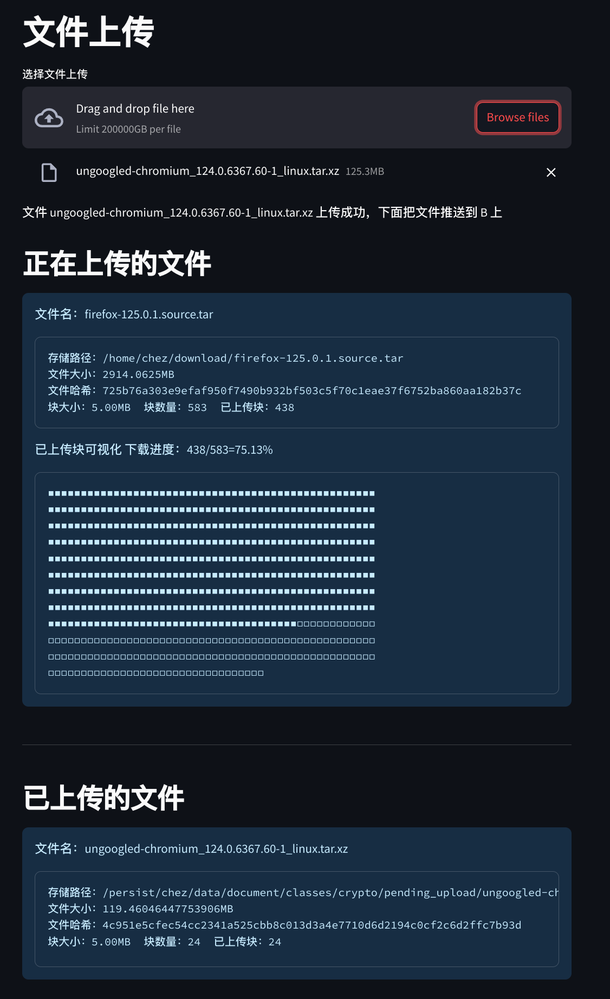

# 密码学及其应用课程设计报告

# UI 介绍



正在上传的文件显示的是客户端的上传状态

# 命令行界面介绍

同时传多个文件


断点续传测试，任意关闭客户端或服务端，进度都不会丢失


# 使用说明

```bash
# 命令行界面
$ python B.py # 开启服务器端
$ python A.py file.zip # 客户端，传输文件 file.zip 到 B
```

```bash
# 使用 ui 界面（只有客户端发送有）
$ python B.py # 服务器端
$ python A_client.py # 开启客户端
$ streamlit run ui_client.py # 运行客户端 web ui ，访问地址为 127.0.0.1:8501
```

# mTLS（my TLS）

协议设计如下，相关代码在 [`mtls.py`](http://mtls.py)


性能测试，客户端不断向服务器端发送数据，服务器端接收，每隔 1 秒计算当前已经收到的所有数据包的大小，就能得到速度。

下面的 speed 速度大约为 500MB/s ，表明了我们协议实现性能的优越性。


## **Diffie–Hellman**


假如用户A和用户B希望交换一个密钥。 

取素数p和整数a，a是p的一个原根，公开a和p。 

A选择随机数XA<p，并计算YA=a^XA mod p。 

B选择随机数XB<p，并计算YB=a^XB mod p。

 每一方都将X保密而将Y公开让另一方得到。 A计算密钥的方式是：K=(YB) ^XA modp B

## AES-256-CCM AEAD 算法

AES_256_CCM 其实就是数据用 AES-CTR 进行加密。然后用 AES-CBC 模式对原文进行加密，然后取最后的一个加密过后的块，作为 MAC，当然，CMAC 计算过程中也会把附加数据记录在内，也能保护明文发送的数据的安全性

CBC 模式（用于计算 MAC ，取最后一个块）


CTR 计数器模式（用于对实际数据进行加密）


计数器模式下，每次与明文分组进行XOR的比特序列是不同的，因此，计数器模式解决了ECB模式中，相同的明文会得到相同的密文的问题。CBC，CFB，OFB模式都能解决这个问题，但CTR的另两个优点是：1）支持加解密并行计算，可事先进行加解密准备；2）错误密文中的对应比特只会影响明文中的对应比特等优点。

由于相同的计数器，相同的明文会产生相同的密文，故计数器输入要为一个随机数，而且永不重用，在我们的实现中，该随机数为  时间戳+序列号+随机数。

# 断点续传协议

断点续传协议建立在 mTLS 的基础上，由于 mTLS 协议已经实现了身份认证+加密的任务，故断点续传这里不会对数据进行加密，只会计算文件 sha256 以便验证数据完整性。


数据将分割为固定大小的块，大小为 5MB，每一块都会先尝试使用 zstd 压缩算法进行压缩，如果压缩后的大小小于当前大小，就发送压缩数据。每一块都有对应的 id，对应其在文件中的位置。当所有块都传输完成后，就对文件整体计算 sha256，相同的话，则发送成功。

服务器端和客户端都保存当前已经传输的块信息，故连接重置后仍然能正确重传。

文件传输信息例子格式如下，主要保存文件大小，文件块大小，未传输的块。

```rust
{
    "state_json_name": "2ae8788e_metasploitable-linux-2.0.0.zip.json",
    "file_name": "metasploitable-linux-2.0.0.zip",
    "file_path": "/home/chez/download/metasploitable-linux-2.0.0.zip",
    "file_size": 865084584,
    "file_sha256": "2ae8788e95273eee87bd379a250d86ec52f286fa7fe84773a3a8f6524085a1ff",
    "block_size": 5242880,
    "block_count": 166,
    "uploaded_blocks": [
        0,
        1,
        2,
        3,
        4
    ]
}
```